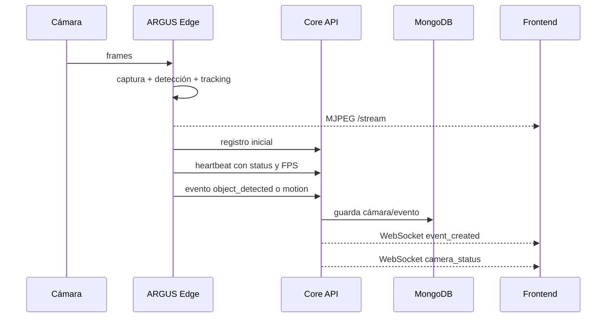

# ARGUS — estado real del backend y evolución del runtime

## 1. Mensaje principal

El backend de ARGUS ya tiene una base funcional y coherente para una demo real de vigilancia distribuida.

La prioridad inmediata no es cambiar todo el cerebro de visión. La prioridad es hacer que el runtime sea observable y demostrable: que se pueda ver qué cámara arrancó, qué modelo cargó, cuántos FPS produce, cuánto tarda la inferencia, cuándo pierde conexión y qué eventos genera.

En otras palabras:

> La funcionalidad central ya existe. La siguiente mejora es convertir el sistema en una plataforma operable y fácil de diagnosticar.

## 2. Qué ya funciona en el backend

### Core API

- FastAPI como servicio central.
- MongoDB como persistencia.
- `/health` comprueba realmente la conexión con MongoDB.
- Registro y consulta de múltiples cámaras.
- Configuración de cámaras desde API.
- Heartbeats enviados por cada Edge.
- Estados de cámara:
  - `online`
  - `degraded`
  - `offline`
- FPS registrado por cámara.
- Eventos persistidos en MongoDB.
- Eventos en tiempo real por WebSocket.
- CORS para el frontend.
- Docker Compose para API y MongoDB.
- Separación de redes:
  - `argus_core_net`: API y MongoDB.
  - `argus_iot_net`: API y Edge.

### Edge Camera Agent

- Captura de webcam integrada.
- Captura de webcam USB.
- Soporte para fuentes numéricas como `0` y `1`.
- Soporte preparado para MJPEG/RTSP.
- Stream MJPEG por `/stream`.
- Health propio por `/health`.
- Detección de movimiento con OpenCV.
- Detección de objetos con YOLO.
- Tracking persistente con ID por objeto.
- Bounding boxes sobre el video.
- Etiquetas y confianza.
- HUD visual con cámara, modo, FPS, objetos y latencia.
- Heartbeat periódico hacia el Core API.
- Reconexión si la fuente de video falla.
- Inferencia separada del ciclo de captura.
- Cooldown para evitar eventos duplicados.
- Configuración de resolución, FPS, calidad JPEG, modelo, confianza e intervalo de inferencia.
- Perfiles de visión:
  - `fast`
  - `balanced`
  - `quality`

### Multi-cámara

La arquitectura ya permite ejecutar dos cámaras locales:

```text
CAM-001 -> webcam integrada -> Edge :8091
CAM-002 -> webcam USB        -> Edge :8092
```

Cada cámara tiene su propio:

- `camera_id`
- proceso Edge
- puerto
- stream
- heartbeat
- FPS
- estado
- conjunto de eventos

El Core API las centraliza en `/api/cameras`.

## 3. Flujo funcional actual



## 4. Qué significa que el backend esté bien hecho

La calidad actual no depende únicamente de que YOLO detecte una persona. La base importante es que el sistema ya separa responsabilidades:

| Responsabilidad | Dónde se resuelve |
|---|---|
| Capturar video | Edge |
| Analizar frames | Edge |
| Dibujar overlays | Edge |
| Publicar stream | Edge |
| Registrar cámara | Core API |
| Determinar salud | Core API + heartbeat |
| Persistir eventos | MongoDB |
| Comunicar cambios | WebSocket |
| Renderizar experiencia | Frontend |

Esto permite reemplazar el modelo, mover un Edge a otra máquina o sumar cámaras sin obligar al frontend a conocer los detalles internos.

## 5. Cómo está el runtime actualmente

Actualmente ya se pueden observar:

- Logs de inicio de Uvicorn.
- Logs de instalación/verificación de dependencias.
- Puerto donde inicia cada Edge.
- Cámara e índice de fuente usados.
- Logs de requests HTTP de Uvicorn.
- Health del Edge con:
  - FPS.
  - modo de visión.
  - modelo.
  - error del detector.
  - cantidad de detecciones.
  - labels.
  - latencia de inferencia.
- Health del Core API con estado de MongoDB.

Lo que todavía falta para que el runtime sea realmente profesional es logging de dominio: mensajes propios del sistema, con niveles, contexto y eventos importantes.

## 6. Cómo debe verse un runtime interesante

No se trata de llenar la consola con texto aleatorio. Los logs deben contar la historia del sistema.

### Inicio del Edge

```text
2026-08-12T05:10:01Z INFO  edge.startup
camera_id=CAM-001 source=0 port=8091 mode=cctv
model=yolo11n.pt profile=balanced
```

```text
2026-08-12T05:10:03Z INFO  edge.detector_loaded
camera_id=CAM-001 model=yolo11n.pt device=cpu input_size=640
```

### Cámara conectada

```text
2026-08-12T05:10:04Z INFO  camera.online
camera_id=CAM-001 source=0 width=1280 height=720
```

### Rendimiento periódico

```text
2026-08-12T05:10:20Z INFO  vision.performance
camera_id=CAM-001 fps=10.41 inference_ms=134.58 detections=1 labels=person
```

Este log no debería aparecer en cada frame. Lo correcto es emitir un resumen cada 10 o 30 segundos.

### Detección

```text
2026-08-12T05:10:22Z INFO  vision.object_detected
camera_id=CAM-001 label=person confidence=0.87 track_id=4
bbox=[120,80,360,500]
```

### Reconexión

```text
2026-08-12T05:11:03Z WARN  camera.read_failed
camera_id=CAM-002 source=1 retry_in_seconds=1
```

```text
2026-08-12T05:11:05Z INFO  camera.reconnected
camera_id=CAM-002 source=1
```

### Heartbeat

```text
2026-08-12T05:11:10Z DEBUG camera.heartbeat_sent
camera_id=CAM-002 status=online fps=9.84 api_status=200
```

### Error del detector

```text
2026-08-12T05:12:01Z ERROR vision.inference_failed
camera_id=CAM-002 model=yolo11n.pt error="..."
```

## 7. Convención de logs recomendada

### Niveles

| Nivel | Uso |
|---|---|
| `DEBUG` | Detalles técnicos de desarrollo, heartbeat y diagnóstico fino |
| `INFO` | Inicio, cámara conectada, modelo cargado, métricas periódicas, detecciones relevantes |
| `WARNING` | Reconexión, frame perdido, API temporalmente no disponible, degradación |
| `ERROR` | Detector fallando, cámara inutilizable, persistencia fallida |
| `CRITICAL` | El servicio no puede iniciar o perdió una dependencia esencial |

### Campos mínimos

Cada log de dominio debería incluir, cuando aplique:

```text
timestamp
level
service
camera_id
event
source
status
fps
latency_ms
error
```

Para producción, conviene emitir JSON estructurado en vez de texto libre:

```json
{
  "timestamp": "2026-08-12T05:10:22Z",
  "level": "INFO",
  "service": "argus-edge",
  "event": "object_detected",
  "camera_id": "CAM-001",
  "label": "person",
  "confidence": 0.87,
  "track_id": 4
}
```

Ventajas:

- Se puede filtrar por `camera_id`.
- Se puede contar cuántos eventos ocurrieron.
- Se pueden detectar cámaras degradadas.
- Se pueden enviar logs a Loki, Elasticsearch, OpenSearch o una plataforma similar.
- El frontend o un servicio de métricas puede consumir información sin interpretar strings.

## 8. Próxima capa de observabilidad

La evolución recomendada del runtime es:

### Fase 1 — logging de dominio

- Crear logger compartido para Core API y Edge.
- Añadir `camera_id` a cada mensaje relevante.
- Loggear startup y shutdown.
- Loggear apertura y cierre de cámara.
- Loggear carga del modelo.
- Loggear reconexiones.
- Loggear errores de API y MongoDB.
- Loggear eventos de detección con cooldown.
- Loggear resumen de rendimiento cada cierto intervalo.

### Fase 2 — métricas

Medir por cámara:

- FPS de captura.
- Latencia de inferencia.
- Frames procesados.
- Frames descartados.
- Detecciones por minuto.
- Errores de lectura.
- Tiempo desde último heartbeat.
- Tiempo de reconexión.
- Eventos por tipo.

### Fase 3 — operación visible

El frontend puede mostrar:

- Actividad reciente del sistema.
- Última detección por cámara.
- FPS y latencia.
- Estado del detector.
- Última reconexión.
- Contador de eventos por minuto.
- Indicador de cámaras silenciosas.

### Fase 4 — observabilidad distribuida

Cuando existan varias réplicas del API o muchos Edge:

- Correlation ID por operación.
- Logs centralizados.
- Métricas Prometheus.
- Dashboards Grafana.
- Alertas por cámara offline.
- Trazas OpenTelemetry si el flujo crece.
- Redis/pub-sub para eventos entre réplicas del Core API.

## 9. Lo que no debemos hacer todavía

- No cambiar el modelo solo por cambiarlo.
- No imprimir un log por cada frame.
- No enviar todos los logs al frontend.
- No guardar frames completos dentro de MongoDB.
- No mezclar logs de depuración con alertas de usuario.
- No considerar que más texto en la consola significa más observabilidad.

El objetivo es que cada log responda una pregunta operacional:

- ¿La cámara arrancó?
- ¿Qué modelo cargó?
- ¿Está capturando?
- ¿A qué FPS?
- ¿Cuánto tarda la inferencia?
- ¿Qué detectó?
- ¿Cuándo perdió conexión?
- ¿Cuándo volvió?
- ¿Por qué está degradada?

## 10. Estado para presentar en la diapositiva

### Backend funcional

- Multi-cámara.
- Procesamiento Edge.
- YOLO + tracking.
- Bounding boxes.
- Streams MJPEG.
- Heartbeats.
- Estados de conexión.
- Eventos persistentes.
- WebSocket en tiempo real.
- Docker Compose.
- Red IoT separada.
- Tailscale preparado para nodos remotos.

### Siguiente evolución

```text
Backend funcional
        ↓
Runtime observable
        ↓
Métricas y dashboards
        ↓
Alertas operativas
        ↓
Escalamiento distribuido
```

## 11. Resumen ejecutivo

ARGUS ya no es solamente una webcam con un modelo conectado. Es una arquitectura distribuida que registra cámaras, mantiene estados de conexión, procesa video en Edge, genera eventos y comunica cambios al frontend.

La mejora más valiosa ahora no es prometer una inteligencia artificial perfecta. Es hacer visible el comportamiento del sistema. Un runtime con logs estructurados, métricas de rendimiento, reconexiones y errores convertirá la demo en un sistema que se puede observar, explicar, depurar y escalar.
